# ChillNotch-Dynamic

<div align="center">

[](https://github.com/LUCKYS1NGHH/ChillNotch-Dynamic)
[](https://github.com/LUCKYS1NGHH/ChillNotch-Dynamic/stargazers)
[](https://github.com/quickshell-mirror/quickshell)
[](https://www.gnu.org/licenses/gpl-3.0)

ChillNotch-Dynamic is a **lightweight**, feature-rich dynamic pill bar for Hyprland, built with **Quickshell**.
It's aimed squarely at users running without a dedicated GPU (like me) — eye candy that doesn't cost you a discrete card. Runs great on integrated graphics.

It runs as a **standalone app**: launch it from your terminal or app launcher when you want it, rather than having it baked
into your session at all times. It's not bound to any dotfiles.

</div>

<div align="center">

[](#resource-usage)
[](#showcase)
[](#features)
[](#configurable-options)
[](#custom-pill-modules)
[](#dependencies)
[](#install)
[](#auto-startup)
[](#key-bindings)
[](#ipc)
[](#troubleshooting)
[](#contributors)

</div>

---

### Resource Usage

- RAM: 200-500 MB (Average 380)
- CPU: Idle 0%, Average 3%, Min 0.1%, Max 10%
- GPU: Idle 0%, Average 15%, Min 6%, Max 45%

> CPU and GPU usage varies with system. a better CPU and GPU use less.

#### My Hardware

- RAM: 8GB (DDR3)
- CPU: i5 3337U (Dual-core)
- GPU: Intel HD 4000 (Integrated)

---

### Showcase

[Watch the demo on YouTube](https://www.youtube.com/watch?v=t7ydMT4F478)

<table>
  <tr>
    <td width="50%">
      <p align="center"><b>Main pill bar</b></p>
      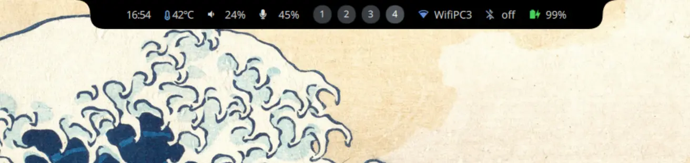
    </td>
    <td width="50%">
      <p align="center"><b>Control center</b></p>
      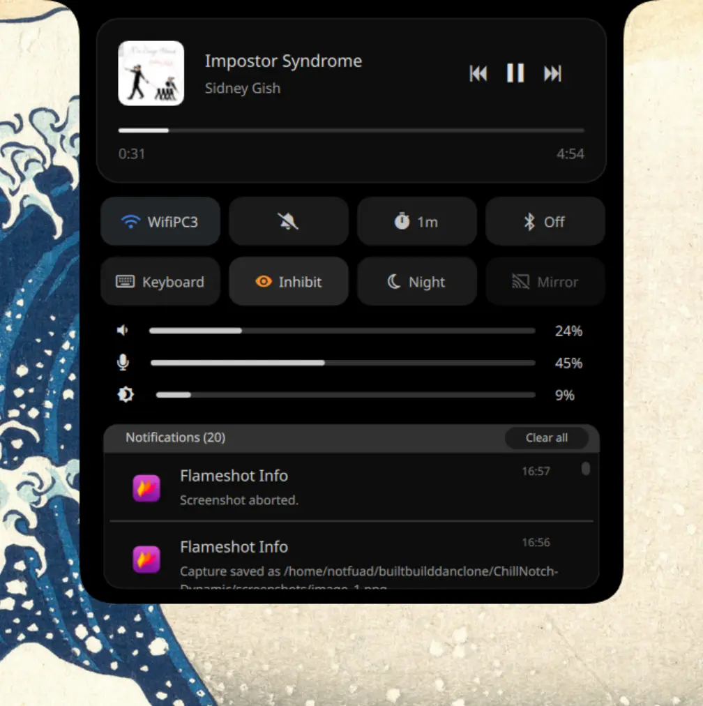
    </td>
  </tr>
  <tr>
    <td width="50%">
      <p align="center"><b>Media playing popup</b></p>
      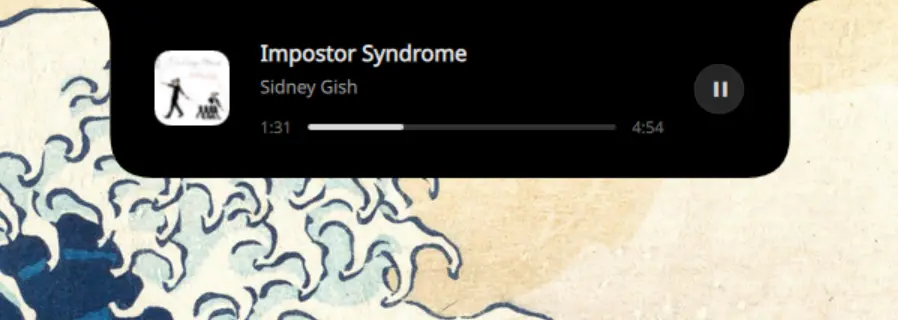
    </td>
    <td width="50%">
      <p align="center"><b>Notification popup (nusgmon-alert)</b></p>
      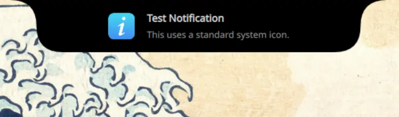
    </td>
  </tr>
  <tr>
    <td width="50%">
      <p align="center"><b>Cliphist (clipboard manager)</b></p>
      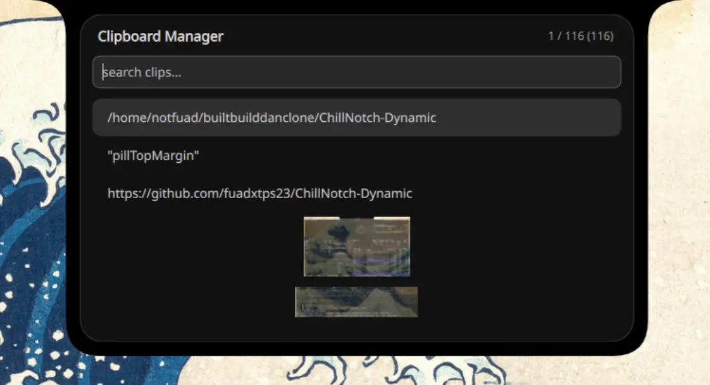
    </td>
    <td width="50%">
      <p align="center"><b>Mini dashboard — calendar</b></p>
      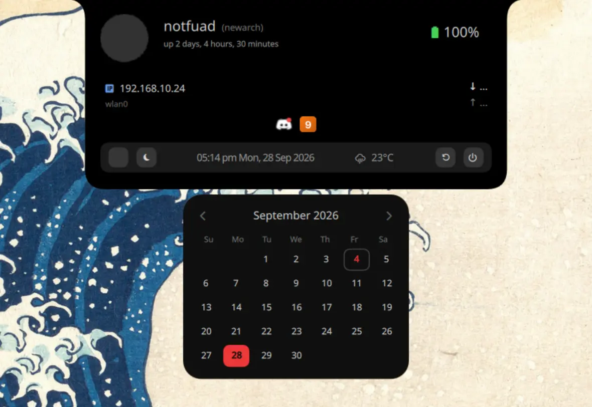
    </td>
  </tr>
  <tr>
    <td width="50%">
      <p align="center"><b>Mini dashboard — weather</b></p>
      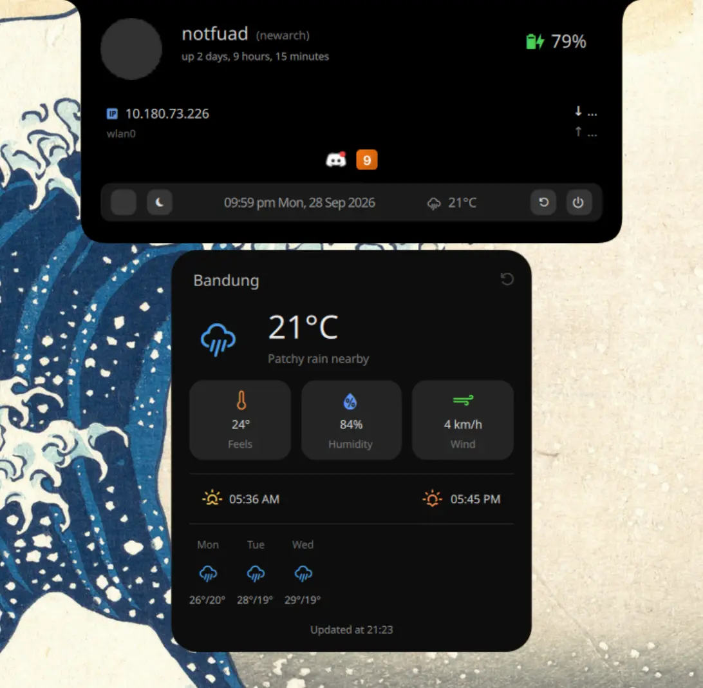
    </td>
    <td width="50%">
      <p align="center"><b>Volume OSD (has more OSDs like brightness, battery, timer)</b></p>
      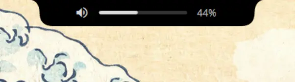
    </td>
  </tr>
  <tr>
    <td width="50%">
      <p align="center"><b>App launcher</b></p>
      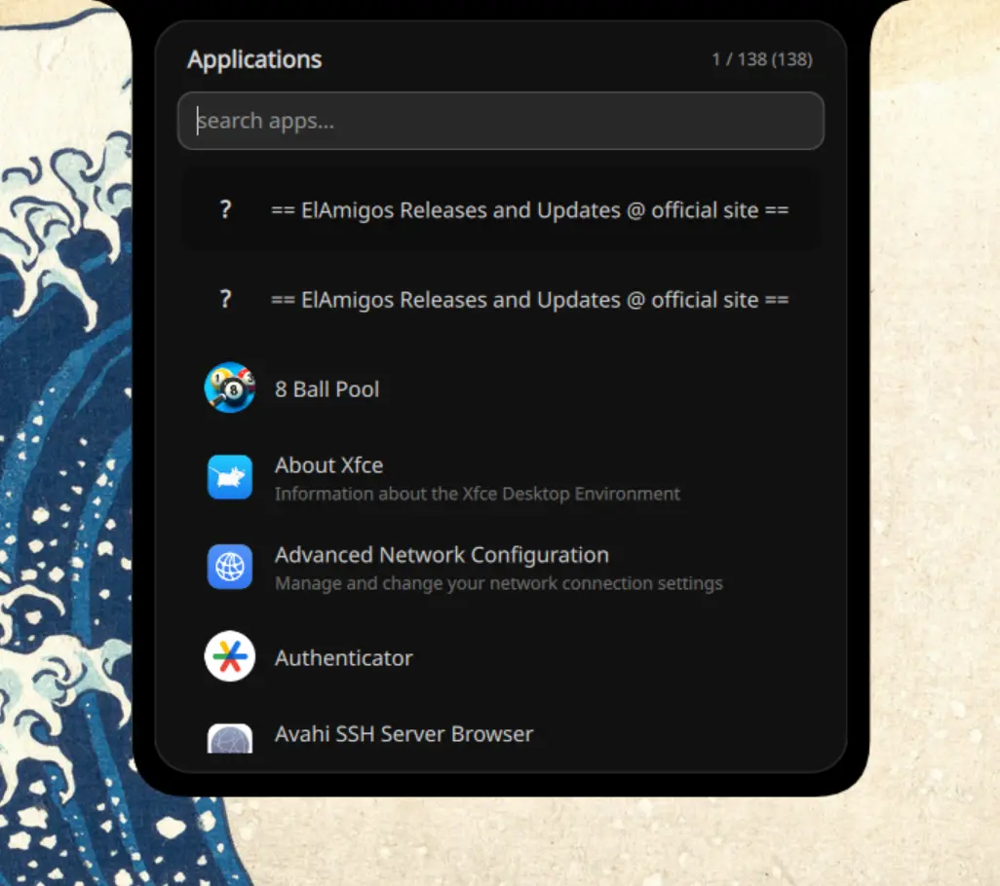
    </td>
    <td width="50%">
      <p align="center"><b>Control center — Wifi and Bluetooth panel</b></p>
      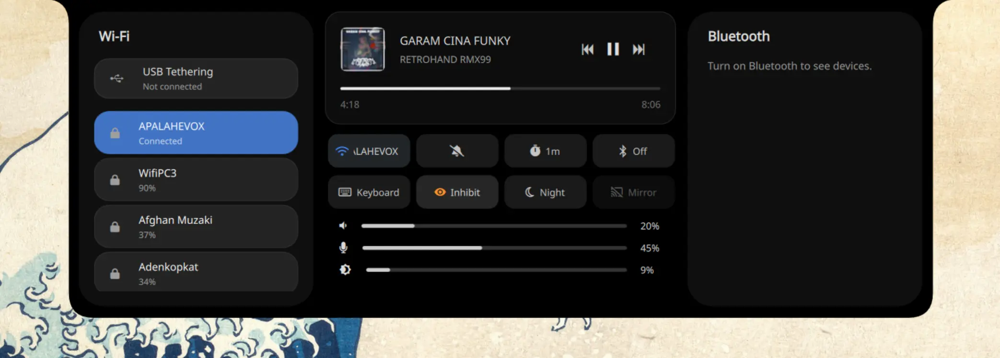
    </td>
  </tr>
  <tr>
    <td width="50%">
      <p align="center"><b>Wallpaper switcher</b></p>
      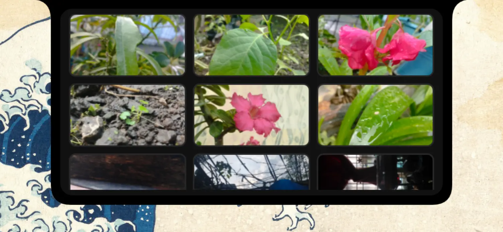
    </td>
    <td width="50%">
      <p align="center"><b>Cliphist — Full preview tab (Image; Text also supports)</b></p>
      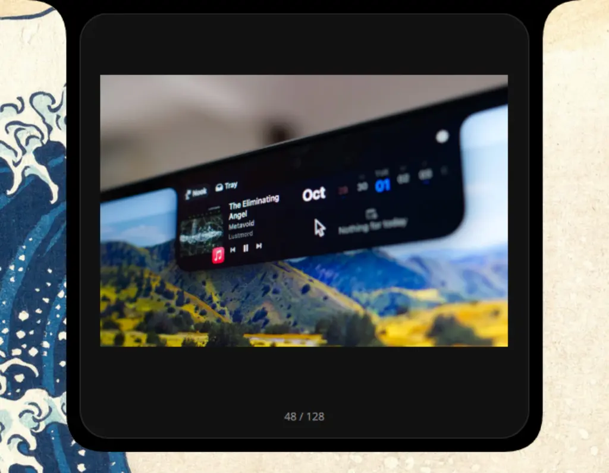
    </td>
  </tr>
</table>

## Features

- **Main Pill Bar**                - Battery, volume, microphone, workspaces, network, clock (default; customizable) — for more module options, see 'Know more' below.
- **Control Center**               - Media player, buttons (WiFi, Silent Notifs, Timer, Bluetooth, On-Screen Keyboard, Idle Inhibitor, Night Light, Monitor Mirror), volume, microphone & brightness sliders, night-light temperature slider, notification stack
- **Cliphist (Clipboard Manager)** - Search, clipboard image preview, item index status, multi select to delete many items at once (`Shift + Up/Down` range, `Shift + Space` pick, `Del` to delete), `Tab` to full preview the clipboard image/text
- **Mini Dashboard**               - Profile image, username, hostname, uptime, battery, basic network info, system tray (below the IP, centered), today's data usage, datetime, weather, calendar, power buttons (lock, sleep, shutdown, reboot)
  - **Calendar Popup**             - Previous/Next month buttons, event dates
  - **Weather Popup**              - Feel, humidity, wind, sunrise & sunset, upcoming 2 days weather forecast, manual refresh button
- **DBus Notification**            - App icon (optional), summary, body (YES! you can ditch swaync/dunst fully now)
- **OSD**                          - Volume, microphone, brightness, timer, battery, Caps Lock / Num Lock and mic-mute OSDs. OSD takes the pill's own size (the pill shrinks to OSD width while it's on screen) and the whole bar hops to the overlay layer while an OSD or notification is visible, then back to top
- **System Tray**                  - Tray apps in the mini dashboard below the IP, centered. Left click activates, right click opens the app's own context menu
- **Wallpaper switcher**           - Wallpaper switcher with previews; animated GIF wallpapers work too
- **Power Menu**                   - Dedicated power pill state with 5 actions (Lock, Sleep, Logout, Restart, Shutdown) and action confirmation prompt
- **Click-outside to close**       - Any open pill state (control center, cliphist, mini dashboard, launcher, wallpaper switcher, power menu, calendar, weather) closes on a click outside the pill

<details>
<summary>Know more</summary>

---
- Main pill bar modules has tooltips

- Extra modules available for the pill bar beyond the defaults: `mic`, `weather`, `bluetooth`, `vpn`, `notifications`, `brightness`

- Pill bar supports custom modules (waybar-style) — run any command/script in the bar with `format`/`tooltip` templates, refresh intervals, streaming output and click actions (see [Custom pill modules](#custom-pill-modules)).

- 3 pill states are open-able with mouse:

  - Control center: `Left click`
  - Cliphist: `Middle click`
  - Mini Dashboard: `Right click`

  For the rest of states, you have to call the IPC through keybinds in Hyprland, which are provided in [Keybinds](#key-bindings)
  section (including the mouse open-able states)

- DPI and Pill scaling is available in the config if you need it.

- Audio, workspaces, bluetooth and wifi in pill bar are clickable.

- Control center's media player progress bar is not only for status, it's usable to control the media you playing.
  also timer minutes can be change by right click and hold-to-burst (stop) it when running.

- Control center has WiFi controller (panel) which has list of active networks and has password prompt.

- The wifi panel also includes the USB tethering toggle.

- Control center has also Bluetooth controller which has list of active, pair & connected devices/networks, device battery. here's 3 cases to connect a bluetooth device first time:

  - case 1: device wants a PIN or passkey typed in
  - case 2: device just wants us to display a code
  - case 3: device wants a yes/no confirmation of a shown passkey

- Cliphist shows image previews from `~/.cache/chillnotch-dynamic/cliphist-imgs` by converting image binaries into real images and save there. if
  you want these images cache to auto delete when you delete the cliphist (clipboard manager) image item, then there's `deleteCliphistImgCache` config
  option (enabled by default).

- In Cliphist full preview tab (which opens through `Tab` key), you can switch to other item by `Up`/`Down` keys, and can also delete the item from there.

- Cliphist items can be multi selected through keys, then deleted in one go with `Del`:

  - `Shift + Up` / `Shift + Down`: mark a range of items, editor style (grows and shrinks from where the range started)
  - `Shift + Space`: mark/unmark the item under the cursor (works in the full preview too, the marked count shows as a chip there)
  - `Ctrl + Click` / `Shift + Click`: same toggle with the mouse
  - `Del`: deletes the marked items, or the highlighted one when nothing is marked
  - `Esc`: drops the marks first, closes the panel on the second press

- Notifications are able to show in slide animation (similar to iOS mute) while you playing video game or watching movie in full screen.
  also it can show custom app icon to show in notification, else it shows bell icon.

- Your today's data usage in mini dashboard is shown by [nusgmon](https://github.com/LUCKYS1NGHH/nusgmon) (i am the creator of it too).

- Wallpaper switcher shows you the filename of the image on hover. uses `awww` in backend to update the wallpaper by default (optional dep). `gif` files in the wallpapers folder show up and apply as animated wallpapers.

- Control center's second button row:

  - `Keyboard` - on-screen keyboard (wvkbd), hidden by default
  - `Inhibit` - blocks idle/sleep (systemd-inhibit), stays on until toggled off
  - `Night` - hyprsunset night light; when on, a color temperature slider appears below brightness
  - `Mirror` - mirrors your screen to an external monitor (HDMI)

  Button states are re-derived from the real processes on every control center open, so they don't lie after a restart.

- Mic volume lives in the pill and in the control center (slider right under volume). Muting from your laptop's mic-mute key shows the mic OSD too.

- Caps Lock / Num Lock changes show an OSD (polls `hyprctl devices`), same size as the volume/brightness OSD.

- Mini dashboard shows your tray apps centered below the IP. Right click one for the app's own menu (needs the shell running in QApplication mode, which `install.sh`/`launcher.sh` already handle).
---
</details>

## Configurable options
> Located at `~/.config/chillnotch-dynamic/config.jsonc`

| Option | Description | Default |
|---|---|---|
| `displayPicture` | Profile image path for mini dashboard | `~/.pfp.png` |
| `clockFormat` | Clock format for the pill bar | `hh:mm` |
| `pillBottomMargin` | Bottom spacing of pill bar | `26` |
| `pillScale` | Scale factor for pill bar size | `1.0` |
| `pillModules` | Pill bar modules order/add/remove. Accepts built-in module names or custom module (see [Custom pill modules](#custom-pill-modules)) | `["battery", "volume", "workspaces", "network", "clock"]` |
| `pillOnHover` | Auto hide the pill bar and only show on hover | `false` |
| `dpiScale` | DPI Scaling | `1.0` |
| `textFontFamily` | Font family for general text | `Monocraft` |
| `nerdFontFamily` | Font family for icons (Nerd Fonts) | `JetBrainsMono Nerd Font Propo` |
| `timerPresets` | Timer minute presets | `[1, 5, 10, 15, 30]` |
| `mediaPopupDuration` | Media-playing popup duration (ms) | `2000` |
| `maxWorkspaces` | Max workspaces shown in pill bar | `5` |
| `notificationDisplayTime` | Notification popup duration (ms) | `3000` |
| `maxNotificationsInStack` | Max notifications shown in stack | `20` |
| `avoidDuplicateNotifications` | Skip appending duplicate notifications to stack | `true` |
| `dataUsageRefreshInterval` | Data usage refresh interval (ms) | `300000` (5 min) |
| `screenLockAppCommand` | Screen lock command for mini dashboard's lock button | `hyprlock` |
| `osdDuration` | OSD (on-screen display) duration (ms) | `800` |
| `weatherLocation` | City for weather widget | `Delhi` |
| `weatherUnits` | Temperature units: `metric` (°C) or `imperial` (°F) | `metric` |
| `weatherRefreshInterval` | Weather refresh interval (ms) | `3600000` (1 hr) |
| `defaultTerminal` | Terminal used to open TUI apps from launcher | `kitty` |
| `wallpapersDir` | Wallpapers directory for wallpaper switcher | `~/Pictures/wallpapers` |
| `wsCloseOnWallpaperSet` | Close wallpaper switcher after apply wallpaper | `true` |
| `wsAnimation` | Wallpaper switcher open animation | `true` |
| `deleteCliphistImgCache` | Delete cached image file on clipboard entry removal, disabled keeps it on disk | `true` |
| `country` | Country for calendar events. accepts country name (India) or ISO 3166-1 alpha-2 (IN) but recommended is country code | `IN` |
| `showAudioVisuals` | Show audio visuals in media player (depends on cava) | `true` |
| `showSensitiveInfo` | Show sensitive VPN info in tooltip (IP, server, region, uptime) | `true` |
| `customWallpaperScript` | Use your own wallpaper script with {path} placeholder | `""` |
| `confirmPowerActions` | Prompt for confirmation before critical power actions (Shutdown, Restart, Logout) | `true` |
| `maxVolume` | Max volume the slider can reach | `100` |
| `separatePreviewTabTypes` | Skip a different item type (image,text) when switching in clipboard manager preview tab | `true` |
| `panelTransparency` | Make the pill/panel background semi-transparent instead of solid black (see [Transparency & blur](#transparency--blur)) | `false` |
| `panelOpacity` | Background opacity used when `panelTransparency` is on; `0.0` (invisible) – `1.0` (solid) | `0.7` |
| `panelBlur` | Compositor blur behind the panel surface. Needs Hyprland's blur enabled for it to be visible (see [Transparency & blur](#transparency--blur)) | `true` |

<details>
<summary>Raw config example</summary>

```jsonc
{
  "displayPicture": "~/.pfp.png",
  "clockFormat": "hh:mm",
  "pillBottomMargin": 26,
  "pillModules": ["battery", "volume", "workspaces", "network", "clock"],
  "pillOnHover": false,
  "textFontFamily": "Monocraft",
  "nerdFontFamily": "JetBrainsMono Nerd Font Propo",
  "timerPresets": [1, 5, 10, 15, 30],
  "mediaPopupDuration": 2000,
  "maxWorkspaces": 5,
  "notificationDisplayTime": 3000,
  "maxNotificationsInStack": 20,
  "dataUsageRefreshInterval": 300000,
  "screenLockAppCommand": "hyprlock",
  "osdDuration": 800,
  "weatherLocation": "Delhi",
  "weatherUnits": "metric",
  "weatherRefreshInterval": 3600000,
  "avoidDuplicateNotifications": true,
  "defaultTerminal": "kitty",
  "pillScale": 1.0,
  "dpiScale": 1.0,
  "wallpapersDir": "~/Pictures/wallpapers",
  "wsCloseOnWallpaperSet": true,
  "wsAnimation": true,
  "customWallpaperScript": "",
  "deleteCliphistImgCache": true,
  "country": "IN",
  "showAudioVisuals": true,
  "showSensitiveInfo": true,
  "confirmPowerActions": true,
  "maxVolume": 100,
  "separatePreviewTabTypes": true,
  "panelTransparency": false,
  "panelOpacity": 0.7,
  "panelBlur": true
}
```

</details>

### Transparency & blur

The panel background is solid black by default. Three config options change that:

```jsonc
"panelTransparency": true, // draw the panel semi-transparent instead of solid black
"panelOpacity": 0.7,       // how see-through it is: 0.0 = invisible, 1.0 = solid black
"panelBlur": true          // compositor blur behind the panel surface
```

- `panelOpacity` is only used while `panelTransparency` is `true`.
- `panelBlur` is applied live: the shell pushes a Hyprland layer rule for its own
  namespace on every change, so flipping it in the config takes effect immediately —
  no shell or Hyprland restart needed (the config file is watched).
- For `panelBlur` to actually blur anything, blur must be enabled in Hyprland itself
  (`decoration:blur` in your Hyprland config, which most dotfiles enable already).
  With blur off at the compositor level, `panelBlur` is a no-op.
- Blur cost is compositor-side. On very weak iGPUs, `"panelBlur": false` with
  `panelTransparency` on gives the frosted-less transparent look for free.

### Custom Pill Modules

Besides the built-in Quickshell modules (`battery`, `workspaces`, `network`, `clock`, `vpn`, `notifications` etc.), `pillModules` also accepts
**object entries** that run any command/script and show its output in the bar — kind of similar to
[waybar's custom module](https://github.com/Alexays/Waybar/wiki/Module:-Custom).

| Key | Description |
|---|---|
| `run` | Command to execute **(required)**. A leading `~` is expanded to `$HOME`. |
| `icon` | Optional nerdfont icon, referenced in `format`/`tooltip` as `{icon}` |
| `format` | Text shown in the bar. Supports `{text}` / `{tooltip}` / `{icon}` placeholders. Default: `{icon} {text}` (or just `{text}` without an icon) |
| `tooltip` | Tooltip shown on hover. Supports `{text}` / `{tooltip}` / `{icon}` placeholders. Default: the output's tooltip |
| `every` | Refresh every N seconds. Omit (or `0`) to run once at startup |
| `stream` | Keep the process running and update the module on every stdout line (`true`) |
| `click` | Command run on left click |

The command may print **plain text** (used as `{text}`) or a **JSON object** per run / per line:

```json
{ "icon": "", "color": "#6d9fd7", "text": "45°C", "tooltip": "45°C CPU Temperature" }
```

`text` is required; `tooltip`, `color` and `icon` are optional. single `{text}` in JSON output fills the `{tooltip}` same.

A sample script ship in the repo and get installed to
`~/.config/chillnotch-dynamic/modules/`: `cpu-temp.sh` (one-shot CPU temperature,
prints a temperature-dependent `{icon, color, text, tooltip}` JSON line).
Use your custom scripts to see specific/niche info in ChillNotch-Dynamic's Pill Bar.

Example `pillModules`:

```jsonc
"pillModules": [
  "battery", "volume", "workspaces", "notifications", "network", "clock",
  {
    "run": "~/.config/chillnotch-dynamic/modules/cpu-temp.sh", // required - rest are optional
    "format": "{icon} {text}",
    "tooltip": "{tooltip}",
    "every": 10
  }
]
```

## Dependencies
> [!NOTE]
> Currently it's tested only on: **Arch Linux** and **NixOS** + **Hyprland**.
> Packages below are Arch's; find the equivalent for your distro.

- [cliphist](https://github.com/sentriz/cliphist)
- [nusgmon](https://github.com/LUCKYS1NGHH/nusgmon) (AUR package; non-Arch users can use the setup script instead)
- [inotify-tools](https://github.com/inotify-tools/inotify-tools)
- [brightnessctl](https://github.com/Hummer12007/brightnessctl)
- [wl-clipboard](https://github.com/bugaevc/wl-clipboard)
- [pipewire](https://github.com/PipeWire/pipewire)
- [blueman](https://github.com/blueman-project/blueman)
- Qt Multimedia (`qt6-multimedia` on Arch)

> [!TIP]
> `install.sh` auto-installs all of the above for Arch users, **except** these optional packages:

- Monocraft Font (`ttf-monocraft-git` / `ttf-monocraft-nerd` on AUR)
- JetBrainsMono Nerd Font (`ttf-jetbrains-mono-nerd` on Arch)
- `qt6-imageformats` (on Arch) more image format support (e.g. WEBP) for wallpaper previews
- `holidays` (Python lib) event dates in calendar; `install.sh` prompts to install this one
- `cava` for showing audio visuals in media player
- `awww` for wallpaper switcher if you don't use custom wallpaper script

## Install

> [!TIP]
> Use my Hyprland [dotfiles](https://github.com/LUCKYS1NGHH/dotfiles), it's also made for No Dedicated GPU machines.
> You will get more better performance.

#### Arch users (AUR)

```bash
paru -S chillnotch-dynamic
```

#### NixOS users (flake with Home Manager)

Add this repository as an input to your flake:

```nix
{
  inputs = {
    chillnotch-dynamic = {
      url = "github:LUCKYS1NGHH/chillnotch-dynamic";
      inputs.nixpkgs.follows = "nixpkgs";
    };
  };
}
```

Enable and configure it in your Home Manager configuration:

```nix
{ chillnotch-dynamic, ... }:
{
  imports = [
    chillnotch-dynamic.homeManagerModules.default
  ];

  programs.chillnotch-dynamic = {
    enable = true;
    settings = {
      clockFormat = "HH:mm";
      # Other options from config.jsonc
    };
  };
}
```

#### Other
```bash
git clone --depth=1 https://github.com/LUCKYS1NGHH/ChillNotch-Dynamic.git
cd ChillNotch-Dynamic
chmod +x install.sh
sudo ./install.sh # use --skip-deps to skip dependencies installation (arch currently)
```

<details>
<summary>Uninstall?</summary>

---

#### AUR
```bash
paru -R chillnotch-dynamic
```

#### Other
```bash
chmod +x uninstall.sh
sudo ./uninstall.sh
```

---
</details>

### Auto startup

To auto-run at every time you start your Hyprland, paste this code in your `~/.config/hypr/hyprland.lua` config file

```lua
hl.on("hyprland.start", function()
   hl.exec_cmd("chillnotch-dynamic")
end)
```

## Key Bindings

Keybindings are highly recommended for ChillNotch-Dynamic in your Hyprland, Just paste this code in your Hyprland (Lua) config file.

> Adjust key combinations by your preferences

```lua
hl.bind(mainMod .. " + CTRL + C",  hl.dsp.exec_cmd("qs ipc -p /usr/share/chillnotch-dynamic call controlCenter toggle"))
hl.bind(mainMod .. " + CTRL + V",  hl.dsp.exec_cmd("qs ipc -p /usr/share/chillnotch-dynamic call cliphist toggle"))
hl.bind(mainMod .. " + CTRL + B",  hl.dsp.exec_cmd("qs ipc -p /usr/share/chillnotch-dynamic call miniDashboard toggle"))
hl.bind(mainMod .. " + D", hl.dsp.exec_cmd("qs ipc -p /usr/share/chillnotch-dynamic call appLauncher toggle"))
hl.bind(mainMod .. " + W", hl.dsp.exec_cmd("qs ipc -p /usr/share/chillnotch-dynamic call wallpaperSwitcher toggle"))
hl.bind(mainMod .. " + Escape", hl.dsp.exec_cmd("qs ipc -p /usr/share/chillnotch-dynamic call powerMenu toggle"))
```

<details>
<summary>NixOS version</summary>

```lua
hl.bind(mainMod .. " + CTRL + C",  hl.dsp.exec_cmd("chillnotch-dynamic-ipc call controlCenter toggle"))
hl.bind(mainMod .. " + CTRL + V",  hl.dsp.exec_cmd("chillnotch-dynamic-ipc call cliphist toggle"))
hl.bind(mainMod .. " + CTRL + B",  hl.dsp.exec_cmd("chillnotch-dynamic-ipc call miniDashboard toggle"))
hl.bind(mainMod .. " + D",  hl.dsp.exec_cmd("chillnotch-dynamic-ipc call appLauncher toggle"))
hl.bind(mainMod .. " + W",  hl.dsp.exec_cmd("chillnotch-dynamic-ipc call wallpaperSwitcher toggle"))
hl.bind(mainMod .. " + Escape",  hl.dsp.exec_cmd("chillnotch-dynamic-ipc call powerMenu toggle"))
```
</details>

## IPC

Every pill state is controllable over Quickshell's IPC, which is how the keybinds
above work — usable from scripts, waybar, rofi bindings, anything that can run a command:

```bash
qs ipc -p /usr/share/chillnotch-dynamic call <target> <function>
```

| Target | Functions | Opens |
|---|---|---|
| `controlCenter` | `toggle` / `show` / `hide` | Control center (media, sliders, buttons, notifications) |
| `miniDashboard` | `toggle` / `show` / `hide` | Mini dashboard (profile, tray, calendar, weather, power) |
| `cliphist` | `toggle` / `show` / `hide` | Clipboard history |
| `appLauncher` | `toggle` / `show` / `hide` | App launcher |
| `wallpaperSwitcher` | `toggle` / `show` / `hide` | Wallpaper switcher |
| `powerMenu` | `toggle` / `show` / `hide` | Power pill state (lock, sleep, logout, restart, shutdown) |

Notes:

- Only one pill state is open at a time — opening another closes the current one.
- The three mouse-openable states (control center, cliphist, mini dashboard) can also
  just be left/middle/right clicked on the pill; IPC exists for the rest and for scripting.
- NixOS users: the same targets work through the `chillnotch-dynamic-ipc` wrapper.

## Troubleshooting

**`module "IslandBackend" is not installed`**
The shell needs its bundled backend on the QML/DLL search path. Always launch through
`launcher.sh` / the installed binary (they set `QML_IMPORT_PATH` and `LD_LIBRARY_PATH`
for you). If you must run `qs` directly:

```bash
QML_IMPORT_PATH=/usr/share/chillnotch-dynamic \
LD_LIBRARY_PATH=/usr/share/chillnotch-dynamic/IslandBackend \
qs -p /usr/share/chillnotch-dynamic
```

**Pill won't appear / second instance**
Check for a stale process (`pgrep -f 'qs -p /usr/share/chillnotch-dynamic'`); a half-dead
instance can hold the layer surface. Kill it and relaunch.

**Config change had no effect**
`config.jsonc` is watched and reloads live, but an invalid JSON/JSONC edit is silently
ignored until fixed — check for trailing commas/quotes. Structural QML errors show up
in the shell log: `strings $(ls -t /run/user/1000/quickshell/by-id/*/log.qslog | head -1)`.

**`panelBlur` does nothing**
Blur is applied by the compositor, not the shell. Enable `decoration:blur` in your
Hyprland config and make sure `panelTransparency` is on so there's something to blur through.

**Wallpaper previews show a broken image icon**
Install `qt6-imageformats` (WEBP support) — previews fall back silently without it.

**Caps Lock OSD lags or doesn't show**
It polls `hyprctl devices` twice a second; if it's missing entirely, verify `hyprctl`
works in your session.

---


### Contributors

Thanks to the contributors who helped make the shell better, and special thanks to [enhaoswen](https://github.com/enhaoswen) for the Wi-Fi controller backend for Quickshell.

<a href="https://github.com/LUCKYS1NGHH/chillnotch-dynamic/graphs/contributors">
  
</a>

### Author

LUCKYS1NGHH / https://github.com/LUCKYS1NGHH/ChillNotch-Dynamic
